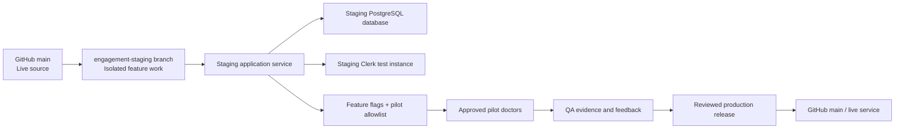

# Synapse Engagement Build: Staging, Safety, and Release Plan

**Purpose:** Define how the Daily Growth Loop, Today’s Growth Plan, action tracking, content activation, cues, weekly review, recovery, and campaign features will be designed and tested without risking the live Synapse application.

**Branch:** `engagement-staging`  
**Current live source baseline:** GitHub `main` at the time of clone.  
**Isolation rule:** No feature code, database migration, notification, or configuration change is deployed to production until it passes the gates in this document and Doc approves promotion.

---

## 1. Safety Principles

The project will follow five non-negotiable rules.

| Rule | Implementation |
|---|---|
| **Separate code** | All engagement work happens in `/home/ubuntu/synapse-engagement-staging` on the `engagement-staging` branch. The existing `/home/ubuntu/synapse-repo` copy is not edited. |
| **Separate runtime** | Staging must use a distinct service and distinct database URL. It must never use the production database URL. |
| **No production data copy** | Staging starts empty or uses only synthetic non-patient fixtures. Patient names, records, diagnoses, and protected health information must not be imported. |
| **Feature flags by default** | New screens, data writes, and notifications remain disabled outside an approved pilot allowlist until tested. |
| **Reversible rollout** | All initial database additions are additive. Turning a feature off hides it and stops automation without deleting historical data. |

## 2. Current Baseline

The isolated clone has been created and a baseline hardening commit has been made locally:

| Item | Status |
|---|---|
| Repository access | Verified against the private Synapse repository. |
| Isolated workspace | `/home/ubuntu/synapse-engagement-staging`. |
| Implementation branch | `engagement-staging`. |
| LLM maintenance | Retired Groq Llama 3.1 8B fallback replaced with supported `openai/gpt-oss-20b`; GPT-OSS reasoning settings and smoke tests corrected. |
| TypeScript check | Passing. |
| Automated tests | 23 passing. |
| Production build | Passing. |
| Live application | Not changed. |

The baseline commit is a recovery point. If later engagement work causes an issue in the isolated branch, the branch can be returned to this commit without touching production.

## 3. Staging Architecture



### Required staging configuration

| Area | Staging requirement | Production-protection requirement |
|---|---|---|
| App service | A new Railway service or a branch-based deployment named clearly as staging. | It must use a separate domain and not receive live traffic. |
| Database | A separate PostgreSQL service/database. | Its `DATABASE_URL` must be different from the live database URL. |
| Clerk | A test/development Clerk instance or explicitly isolated staging keys. | Never point staging at the production Clerk instance if test users could affect live accounts. |
| AI keys | Separate keys or a budget-limited project if available. | No uncontrolled large-volume AI generation in pilot. |
| Email | Sandbox/allowlisted recipient mode only. | No pilot email can reach a non-allowlisted recipient. |
| Stripe | Test keys only; payment flows are out of scope for the engagement pilot. | Never process a real payment in staging. |
| Analytics | Mark every event with `environment: staging`. | Do not blend pilot events with live business reporting. |

## 4. Notification and Weekly Review Delivery Options

Synapse needs contextual prompts and a weekly review, but the delivery mechanism should be chosen deliberately. The initial product should not add SMS until the daily action loop proves useful.

| Approach | Doctor experience | Tradeoffs | Cost | Setup complexity |
|---|---|---|---|---|
| **In-app plan plus scheduled email summary** — recommended first | The doctor sees the plan in Synapse and can optionally receive one daily email at a chosen work anchor plus a Friday review. | Works even if browser push is disabled; email may be missed and requires a reliable delivery configuration. | Low incremental cost when using an existing authorized email provider. | Moderate: needs an allowlist, preferences, unsubscribe/pause controls, and a reliable scheduled execution method. |
| **In-app plan plus browser push** | The doctor receives a concise prompt directly on device/browser after granting permission. | More immediate, but permission rates and delivery reliability vary; users can perceive it as intrusive. | Usually low. | Moderate: requires notification permission, service-worker testing, and platform-specific QA. |
| **In-app only** — lighter-weight pilot alternative | The doctor opens Synapse intentionally and sees Today’s Growth Plan. | Safest and simplest; does not test external reminder behavior. | No external delivery cost. | Low. |

**Recommendation:** Build the action system so it works completely in-app first. Add **opt-in daily email and Friday review** after the pilot validates the plan and outcome flows. Browser push is an optional second delivery channel. SMS remains out of scope until there is explicit patient-free use, clear consent, a budget, and evidence that email/in-app prompts are insufficient.

## 5. Feature-Flag Strategy

All engagement capabilities will be gated at both the server and client layers. Flags are read from environment configuration and can be restricted to approved pilot users.

| Flag | Default | Purpose | Emergency rollback behavior |
|---|---:|---|---|
| `ENGAGEMENT_DAILY_PLAN_ENABLED` | `false` | Shows Today’s Growth Plan and permits plan retrieval. | Hide `/today` and return existing home flow. |
| `ENGAGEMENT_ACTIONS_ENABLED` | `false` | Allows creating, completing, deferring, and reflecting on action records. | Disable mutations; preserve stored records. |
| `ENGAGEMENT_CONTENT_ACTIVATION_ENABLED` | `false` | Shows “Use this today” actions from coaching, content, routine, and Lyle sources. | Hide activation CTAs. |
| `ENGAGEMENT_WEEKLY_REVIEW_ENABLED` | `false` | Enables review page and weekly summary generation. | Hide review entry points; do not delete data. |
| `ENGAGEMENT_EMAIL_ENABLED` | `false` | Sends approved pilot emails. | Stop sends immediately. |
| `ENGAGEMENT_CAMPAIGNS_ENABLED` | `false` | Enables structured multi-day campaigns. | Hide campaigns and preserve activity history. |
| `ENGAGEMENT_PILOT_CLERK_IDS` | empty | Comma-separated approved pilot identities. | No non-allowlisted user sees enabled functionality. |

The server is the source of truth. A client-only flag is not sufficient because it does not prevent unauthorized data writes or outbound delivery.

## 6. Additive Data Model and Migration Policy

The engagement system adds new tables only. It does not modify or delete existing curriculum, WWLD, Lyle, Content Studio, daily-task, billing, or user records in the first release.

| Table | Purpose | Key fields | Migration safety |
|---|---|---|---|
| `daily_growth_plans` | One plan per user/day. | `user_id`, `plan_date`, `focus`, `state`, timestamps. | New table; unique user/date. |
| `growth_actions` | A recommended or user-selected real-world growth action. | `user_id`, source, title, why-now, estimate, script, status, date. | New table; no destructive dependencies. |
| `daily_growth_plan_actions` | Ordered actions associated with a plan. | `plan_id`, `action_id`, `sort_order`, `required`. | New join table. |
| `growth_action_outcomes` | Optional proof/result following action completion. | `action_id`, `user_id`, outcome type, confidence, note, completion time. | New table; no patient identifiers. |
| `user_engagement_preferences` | Work anchors and delivery preferences. | `user_id`, timezone, anchor times, channels, quiet days. | One record/user. |
| `engagement_events` | Product-event telemetry. | user, event name, entity, metadata, timestamp. | New append-only table. |

### Migration rules

1. Write migrations as idempotent SQL using `CREATE TABLE IF NOT EXISTS` and additive indexes.
2. Run every migration against staging first and verify row/table counts before considering production.
3. Keep a written SQL artifact under `server/migrations/` and a matching Drizzle schema definition.
4. Never use a database migration to seed pilot users, insert fake production activity, or mutate existing WWLD sessions.
5. If a migration fails, stop the rollout; do not improvise against production.
6. Before any production migration, take the existing backup path and record a release checkpoint.

## 7. Deterministic Daily Plan Selection Rules

The first selector must be explainable. It should not use unconstrained AI decision-making.

```text
1. Missing end-of-day WWLD entry, only at the user’s chosen close-of-day anchor
2. Uncompleted Lyle daily action, if a recommendation exists
3. Newly saved coaching asset with no recorded real-world use
4. User-selected weekly focus or campaign action
5. Existing personalized Daily Routine task
6. Optional discovery/learning action
```

### Constraints

| Rule | Rationale |
|---|---|
| Maximum one required action and two optional actions. | Prevents task overload. |
| Every action contains “Why now?” and an honest time estimate. | Protects trust and reduces decision load. |
| Opening a script does not count as completion. | Distinguishes reading from real-world behavior. |
| Completion must take less than 30 seconds. | Fits a practice day. |
| Deferral is permitted and informs later selection. | Avoids guilt and makes recommendations smarter. |
| No patient names or patient notes. | Keeps the system focused on practice behavior and reduces privacy risk. |
| Lyle content keeps its existing 12-month content deduplication rule. | Preserves existing recommendation integrity. |

## 8. Acceptance Criteria by Build Phase

### Phase A — Foundation and safety

| Requirement | Acceptance criterion |
|---|---|
| Database isolation | Staging connection URL is confirmed distinct from production before any schema action. |
| Flag isolation | A non-pilot account receives existing behavior even when a feature is enabled for pilot users. |
| User scoping | Every read/write uses the authenticated application user ID; cross-user records cannot be read or written. |
| Existing regression protection | TypeScript, unit tests, and production build pass before feature work moves forward. |

### Phase B — Today’s Growth Plan and action tracking

| Requirement | Acceptance criterion |
|---|---|
| Plan cap | The user sees no more than three actions, with at most one marked required. |
| Action source | A plan can correctly surface a Lyle action and a personalized routine/coaching action. |
| Explainability | Every displayed action has a valid source and a nonempty why-now explanation. |
| Completion | User can record completion and optional result in under 30 seconds on mobile. |
| Deferral | A deferred action does not create a red overdue backlog or duplicate action records. |
| Query consistency | Completing an action refreshes Today, WWLD context, and applicable task states without a full reload. |

### Phase C — Content activation and review

| Requirement | Acceptance criterion |
|---|---|
| Coaching activation | A newly confirmed coaching answer creates a relevant use-today action only when enabled. |
| Content activation | Generated/saved content can create a recordable “drafted/recorded/posted/sent” action. |
| Weekly review | The review states action and trend facts accurately without causal overclaims. |
| Re-entry | A user inactive for 3+ days sees one restart action, not an unbounded backlog. |

### Phase D — Cues and campaign pilot

| Requirement | Acceptance criterion |
|---|---|
| Consent | No external reminder is sent without explicit preference and pilot allowlist inclusion. |
| Suppression | Completed/muted actions do not generate redundant prompts. |
| Allowlist | Staging delivery reaches only named test recipients. |
| Campaign | One campaign produces a coherent 7–14 day series of capped daily actions with outcome capture. |

## 9. Test Strategy

| Test level | Examples | Gate |
|---|---|---|
| Unit | Plan selection priority, state transitions, user scoping, deduplication, flag parsing, time-zone date boundaries. | Required for every feature merge. |
| Integration | tRPC mutation writes action/outcome and invalidates plan queries; blocked user cannot access actions. | Required before staging. |
| Migration | Empty staging database creates tables; re-run is harmless; existing app tables remain unchanged. | Required before any shared environment migration. |
| Mobile web manual smoke | 375px viewport; plan scan, deep links, complete/defer, weekly review, re-entry. | Required before pilot. |
| LLM regression | Gemini → Groq fallback chain remains callable and returns user-facing content. | Required before release. |
| Pilot | Doctors can explain what to do today and complete an action without staff assistance. | Required before production promotion. |

## 10. Rollback Plan

| Failure | Immediate action | Data handling |
|---|---|---|
| Daily plan confuses users | Set `ENGAGEMENT_DAILY_PLAN_ENABLED=false`. | Keep data for diagnosis; no deletion. |
| Action recording issue | Set `ENGAGEMENT_ACTIONS_ENABLED=false`; keep plan read-only if safe. | Preserve existing records. |
| Bad recommendation | Disable source-specific activation flag or pilot allowlist. | Tag/report issue; do not silently change historical action text. |
| Email misfire | Set `ENGAGEMENT_EMAIL_ENABLED=false` and pause scheduler. | Review send log; no retry until approved. |
| Migration failure | Stop rollout and restore staging from checkpoint. | Production remains untouched. |
| Production issue after promotion | Turn flags off first; then revert the production commit only if necessary. | Additive data survives; no destructive rollback required. |

## 11. Pilot Definition

The first pilot should validate usefulness—not scale. The initial recommended campaign is **New Patients and Referrals**, because it pairs naturally with the existing Lyle new-patient signal, saved referral language, Content Studio, and routine tasks.

| Element | Pilot proposal |
|---|---|
| Participants | 3–10 willing doctors or team members, each explicitly allowlisted. |
| Duration | Two weeks following onboarding and a short baseline period. |
| Daily ask | One required/reflection action plus up to two optional actions. |
| Channels | In-app only for the first usability round; opt-in email only after those flows are stable. |
| Success evidence | Pilot doctors can identify the next action, use the supplied asset, log proof quickly, and report reduced decision burden. |
| Practice signals | Monitor action completion, confidence, and WWLD/new-patient context; do not claim causality. |

## 12. Explicit Approval Gates

The following actions require Doc’s confirmation before they occur.

| Gate | Approval needed |
|---|---|
| Create a Railway staging service and separate database | Yes. |
| Add test Clerk keys/instance | Yes, if a new instance is needed. |
| Send any external email | Yes, after recipient allowlist and copy are reviewed. |
| Enable feature for anyone beyond named pilot users | Yes. |
| Run a production database migration | Yes. |
| Merge/push release to `main` or trigger production deployment | Yes. |

## 13. Next Step

With the isolated baseline complete, the next engineering deliverable is an **engagement foundation specification and skeleton**: shared types, feature-flag helper, schema definitions, idempotent migration plan, and deterministic daily-plan selection contract. It remains feature-flagged and local until staging approval.
